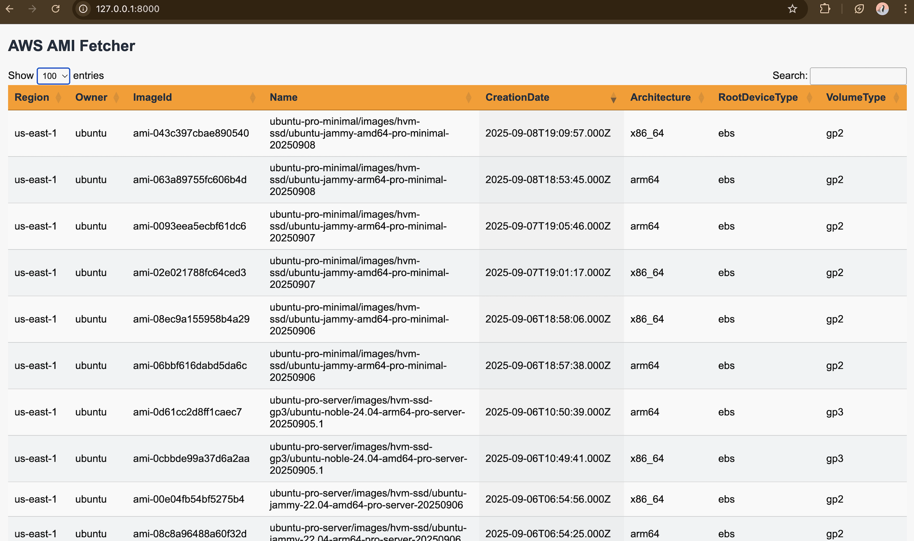

# AWS AMI Fetcher

A simple Python tool to fetch AMI (Amazon Machine Image) IDs across AWS regions and save them into a CSV file.

## Files

- `fetch_amis.py` → Main script.
- `config.yaml` → Configuration for owners (publishers) and AWS regions.
- `amis.csv` → Output file (generated after running the script).
- app.py → Web application to view AMIs in browse

## Requirements

- Python 3.7+
- AWS credentials configured (`~/.aws/credentials` or environment variables).
  ```
  export AWS_ACCESS_KEY_ID=YOUR_ACCESS_KEY
  export AWS_SECRET_ACCESS_KEY=YOUR_SECRET_KEY
  export AWS_DEFAULT_REGION=us-east-1
  ```
- Minimum IAM permissions(Your IAM user/role needs permissions for:)
  ```json
          {
            "Version": "2012-10-17",
            "Statement": [
              {
                "Effect": "Allow",
                "Action": [
                  "ec2:DescribeRegions",
                  "ec2:DescribeImages"
                ],
                "Resource": "*"
              },
              {
                "Effect": "Allow",
                "Action": "sts:GetCallerIdentity",
                "Resource": "*"
              }
            ]
          }
  ```

## Setup & Usage

- Clone the repository:

```bash
git clone https://github.com/DevOpswithAnkita/aws-ami-fetcher.git
cd aws-ami-fetcher
```

- Configure `config.yaml` for AWS regions and AMI owners. Only the required OS/Owner-id are included here.

```bash
regions:
  - us-east-1
  - us-west-2
owners:
  ubuntu: "099720109477"   # Canonical (Ubuntu) owner ID
```

- How to run repo using cli:
  ```bash
  #Install required packages:
  pip install -r requirements.txt
  #Fetch AMIs and generate amis.csv:
  python3.10 fetch_amis.py
  #Start the web application to view AMIs in browser:
  python3.10 app.py
  - Open your browser at:
  Running on http://127.0.0.1:8000

  ```



## References

- **Ubuntu (Canonical)**: [cloud-images.ubuntu.com](https://cloud-images.ubuntu.com/locator/ec2/) – Official Ubuntu AMI locator.
- **Amazon Linux 2**: [AWS Blog](https://aws.amazon.com/blogs/compute/query-for-the-latest-amazon-linux-ami-ids-using-aws-systems-manager-parameter-store/) – How to query the latest Amazon Linux AMIs using Systems Manager Parameter Store.
- **Red Hat Enterprise Linux (RHEL)**: [EC2 Console](https://console.aws.amazon.com/ec2/) – Search for RHEL AMIs with owner alias `309956199498`.
- **SUSE Linux Enterprise Server (SLES)**: [EC2 Console](https://console.aws.amazon.com/ec2/) – Search for SLES AMIs with owner alias `013907871322`.
- **Debian**: [EC2 Console](https://console.aws.amazon.com/ec2/) – Search for Debian AMIs with owner alias `136693071363`.
- **Microsoft Windows Server**: [EC2 Console](https://console.aws.amazon.com/ec2/) – Search for Windows Server AMIs with owner alias `801119661308`.
